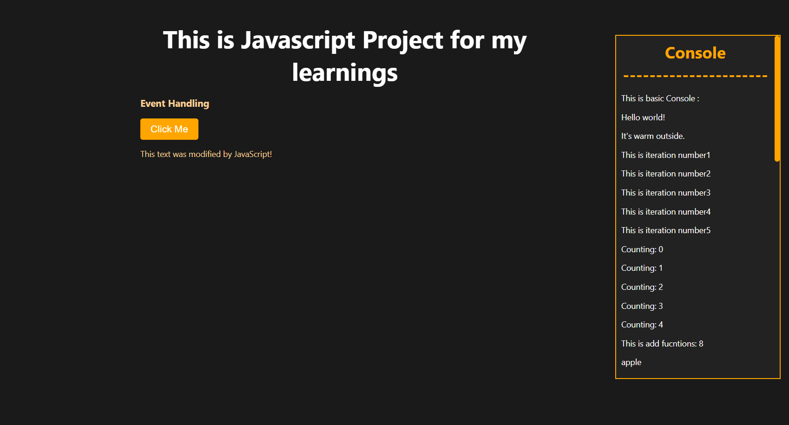

# Learning Basics of JavaScript

Welcome to the Learning Basics of JavaScript GitHub project! This repository is designed to help you grasp the foundational concepts of JavaScript programming. Whether you're an absolute beginner or looking to refresh your skills, this project provides comprehensive resources to get you started on your JavaScript journey.

# Topics Covered

In this project, we cover essential JavaScript topics such as:

Variables and Data Types
Control Flow and Loops
Functions and Scope
Objects and Arrays
DOM Manipulation
Asynchronous Programming (Callbacks, Promises)
ES6+ Features

# Resources

Check out these additional resources to enhance your JavaScript learning:

Mozilla Developer Network (MDN)
JavaScript.info
FreeCodeCamp
chatgpt
youtube
devdocs.io
